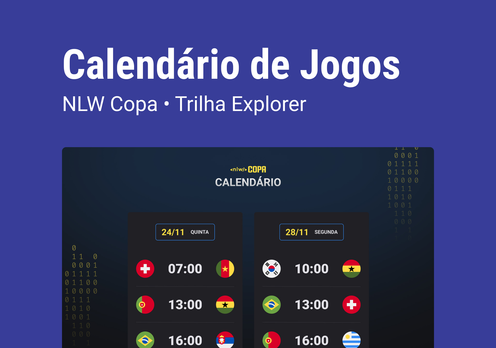

<h1 align="center"> Explorer NLW Copa #10 </h1>

     Participation at the event offered for Rocketseat.

  <a href="#-technologies">Technologies</a>&nbsp;&nbsp;&nbsp;|&nbsp;&nbsp;&nbsp;
  <a href="#-project">Projects</a>&nbsp;&nbsp;&nbsp;|&nbsp;&nbsp;&nbsp;
  <a href="#-layout">Layout</a>&nbsp;&nbsp;&nbsp;|&nbsp;&nbsp;&nbsp;
  <a href="#memo-license">License</a>

  

 

  

## 🚀 Technologies

This project was developed whith this technologies: 

- HTML, CSS and JavaScript

## 💻 Project

Games Calendar
## 🔖 Layout

You see the layout for project through [OF THIS LINK](). Is necessary have account at [Figma](https://figma.com) for access.

## :memo: License

This project is licensed
---

